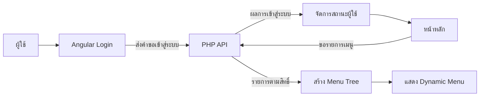

# Role-Based Login and Dynamic Menu Example

ตัวอย่างระบบเข้าสู่ระบบและเมนูตามสิทธิ์ผู้ใช้ สำหรับแสดงแนวคิดการแยก **Angular frontend** และ **PHP API** ในรูปแบบที่อ่านง่าย เหมาะสำหรับการเรียนรู้และใช้ประกอบ portfolio

> สถานะ: learning prototype สำหรับสาธิตโครงสร้างโปรแกรมและ user flow ยังไม่ใช่ระบบยืนยันตัวตนที่พร้อมใช้งานจริง

## จุดเด่นของตัวอย่าง

- หน้า Login ด้วย Angular standalone component
- ตรวจข้อมูลที่ผู้ใช้กรอก พร้อม loading และ error state
- แยก HTTP services ออกจาก UI components
- เก็บสถานะผู้ใช้เพื่อส่งต่อจากหน้า Login ไปหน้าหลัก
- แสดงเมนูตามสิทธิ์ที่ backend ส่งกลับมา
- สร้างเมนูแบบ parent-child และเรียงลำดับก่อนแสดงผล
- รองรับการเปิดและปิดรายการเมนูย่อย
- แยก frontend และ backend ชัดเจนเพื่อให้พัฒนาต่อได้ง่าย

## ภาพรวมการทำงาน



รายละเอียดโครงสร้างและการเชื่อมต่อแหล่งข้อมูลภายในไม่รวมอยู่ในเอกสาร public นี้ ผู้ที่นำตัวอย่างไปทดลองควรใช้ environment และข้อมูลจำลองของตนเองเท่านั้น

## โครงสร้าง repository

```text
angular/
├── api/                       PHP API สำหรับตัวอย่าง
└── unb-frontend/
    ├── src/app/login/         หน้าเข้าสู่ระบบ
    ├── src/app/main/          หน้าหลักและ Dynamic Menu
    ├── src/app/services/      Authentication และ API clients
    ├── src/app/app.routes.ts  Routes ของแอปพลิเคชัน
    └── package.json           Scripts และ dependencies
```

## เทคโนโลยี

- Angular 22 standalone components
- TypeScript 6
- RxJS และ Angular HttpClient
- PHP 8
- Vitest ผ่าน Angular CLI

## ทดลอง frontend

```powershell
cd angular\unb-frontend
npm ci
npm start
```

เปิด `http://localhost:4200/`

การทดลอง flow แบบครบระบบต้องเปิด PHP API และตั้งค่า test environment ของผู้ทดลองเอง ห้ามใช้ credential หรือข้อมูลจริงใน repository สาธารณะ

## Build และ test

```powershell
cd angular\unb-frontend
npm test
npm run build
```

ชุดทดสอบปัจจุบันครอบคลุมระดับเริ่มต้นของ Angular components และ services ส่วน end-to-end authentication ยังอยู่ในแผนพัฒนาต่อ

## ขอบเขตด้านความปลอดภัย

Repository นี้สร้างเพื่ออธิบายแนวคิด จึงควรเพิ่มส่วนต่อไปนี้ก่อนนำไปใช้จริง:

- ใช้ server-verified session หรือ access token ที่มีอายุใช้งาน
- ตรวจสิทธิ์ที่ backend ทุก request
- จัดเก็บ configuration และ secrets นอก source code
- เพิ่ม route guard, logout และ session expiry
- ใช้ HTTPS พร้อมกำหนด CORS ตาม environment
- เพิ่ม rate limiting, audit logging และ automated security tests
- ใช้ข้อความผิดพลาดที่ไม่เปิดเผยรายละเอียดภายในระบบ

## แนวทางพัฒนาต่อ

- เพิ่ม session lifecycle และหน้า logout
- เพิ่ม Angular route guard และ HTTP interceptor
- แยก configuration สำหรับ development, test และ production
- เพิ่ม unit, API และ end-to-end tests
- เพิ่ม responsive states และ accessibility
- เชื่อมเมนูกับ Angular Router ให้สมบูรณ์

## สิ่งที่ repository นี้ใช้สาธิตใน portfolio

1. การออกแบบ component และ service ให้แยกหน้าที่กัน
2. การสื่อสารระหว่าง Angular และ PHP ผ่าน HTTP
3. การจัดการสถานะผู้ใช้และ error state
4. การสร้างเมนูแบบลำดับชั้นจากข้อมูลที่ backend ส่งมา
5. การประเมินช่องว่างระหว่าง prototype กับ production system

ไม่มีบัญชี รหัสผ่าน หรือข้อมูลผู้ใช้งานจริงสำหรับสาธิตใน repository นี้


