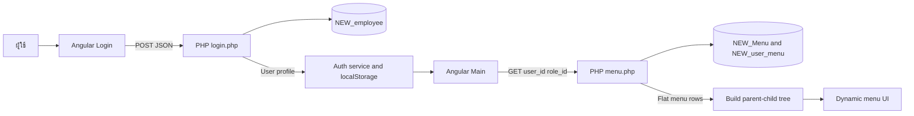

# Role-Based Login and Dynamic Menu Example

ตัวอย่างการแยก frontend และ backend สำหรับระบบเข้าสู่ระบบและเมนูตามสิทธิ์ผู้ใช้ โดยใช้ **Angular 22**, **PHP** และ **Microsoft SQL Server**

Repository นี้แสดง flow ตั้งแต่รับ username/password, ตรวจข้อมูลพนักงาน, เก็บข้อมูลผู้ใช้ฝั่ง browser, โหลดรายการเมนูตาม role/user permission และประกอบเมนูแบบ parent-child บน Angular

> สถานะ: learning/portfolio example สำหรับศึกษา integration ระหว่าง Angular, PHP และฐานข้อมูลเดิม ยังไม่พร้อมใช้เป็น production authentication system

## สิ่งที่ตัวอย่างนี้ทำได้

- หน้า Login แบบ standalone Angular component
- ตรวจ input และแสดง loading/error state
- เรียก PHP Login API ด้วย JSON
- รองรับ password hash ผ่าน `password_verify()`
- เก็บข้อมูลผู้ใช้ปัจจุบันใน `localStorage`
- โหลดเมนูทั้งหมดสำหรับ role ผู้ดูแล
- โหลดเมนูเฉพาะที่กำหนดใน `NEW_user_menu` สำหรับผู้ใช้ทั่วไป
- เพิ่ม parent menu อัตโนมัติเมื่อผู้ใช้มีสิทธิ์ในเมนูลูก
- แปลงรายการเมนูจาก API เป็น tree และเรียงตาม `sort_order`
- เปิด/ปิดเมนูที่มีรายการย่อย

## สถาปัตยกรรม



## โครงสร้าง repository

```text
angular/
├── api/
│   ├── db.php                 เชื่อม SQL Server ด้วย sqlsrv
│   ├── login.php              ตรวจ username/password และคืนข้อมูลผู้ใช้
│   └── menu.php               อ่านเมนูตาม role และ user permission
└── unb-frontend/
    ├── src/app/login/         หน้า Login
    ├── src/app/main/          หน้าหลักและ menu tree
    ├── src/app/services/
    │   ├── auth.ts            เก็บ/อ่าน/ลบ current user
    │   ├── login.ts           Angular Login API client
    │   └── menu.ts            Angular Menu API client
    ├── src/app/app.routes.ts  Routes สำหรับ /login และ /main
    └── package.json           Angular scripts และ dependencies
```

## เทคโนโลยี

- Angular 22 standalone components
- TypeScript 6
- RxJS และ Angular HttpClient
- PHP 8
- Microsoft Drivers for PHP for SQL Server (`sqlsrv`)
- SQL Server Express
- Vitest ผ่าน Angular CLI

## Database contract

ตัวอย่างนี้คาดว่ามีฐานข้อมูล `WINS_UNB` และตารางต่อไปนี้อยู่แล้ว:

### `NEW_employee`

ฟิลด์ที่ใช้งาน:

- `emp_id`
- `username`
- `password`
- `name_thai`
- `surname_thai`
- `hrmi_id`
- `role_id`

### `NEW_Menu`

ฟิลด์ที่ใช้งาน:

- `menu_id`
- `menu_name`
- `page`
- `icon`
- `parent_id`
- `sort_order`
- `is_active`

### `NEW_user_menu`

ใช้ `user_id` และ `menu_id` เพื่อกำหนดสิทธิ์เมนูรายบุคคล

Repository นี้ไม่ได้รวม schema, seed data หรือข้อมูลจริงของฐานข้อมูล ผู้ทดลองต้องเตรียมตารางทดสอบที่ไม่มีข้อมูลส่วนบุคคลก่อนรัน

## API contract

### `POST /login.php`

Request:

```json
{
  "username": "demo-user",
  "password": "demo-password"
}
```

Success response:

```json
{
  "success": true,
  "message": "เข้าสู่ระบบสำเร็จ",
  "user": {
    "emp_id": 1001,
    "user_id": 1001,
    "role_id": 1,
    "username": "demo-user",
    "name_thai": "ผู้ใช้",
    "surname_thai": "ตัวอย่าง",
    "hrmi_id": null
  }
}
```

### `GET /menu.php?user_id=1001&role_id=1`

คืนเมนูแบบ flat list แล้ว Angular จะสร้าง tree จาก `parent_id`

```json
{
  "success": true,
  "message": "Menu loaded successfully",
  "menus": [
    {
      "menu_id": 1,
      "menu_name": "หน้าหลัก",
      "page": "#",
      "icon": null,
      "parent_id": null,
      "sort_order": 1
    }
  ]
}
```

## วิธีรันในเครื่อง

### 1. สิ่งที่ต้องมี

- Node.js รุ่นที่รองรับ Angular 22
- npm 11 หรือรุ่นที่เข้ากันได้กับ `package-lock.json`
- PHP 8 พร้อม extension `sqlsrv` และ `pdo_sqlsrv`
- SQL Server Express ที่มีฐานข้อมูลและตารางตาม contract

### 2. ตั้งค่า PHP API

ตรวจค่าใน `angular/api/db.php`:

```php
$serverName = "localhost\\SQLEXPRESS";

$connectionOptions = [
    "Database" => "WINS_UNB",
    "CharacterSet" => "UTF-8",
    "TrustServerCertificate" => true
];
```

ตัวอย่างปัจจุบันใช้ Windows/Integrated Authentication เพราะไม่ได้ระบุ `UID` และ `PWD` ใน source code

เปิด PHP development server:

```powershell
cd angular\api
php -S localhost:8000
```

### 3. เปิด Angular

```powershell
cd angular\unb-frontend
npm ci
npm start
```

เปิด `http://localhost:4200/` โดย frontend จะเรียก:

- `http://localhost:8000/login.php`
- `http://localhost:8000/menu.php`

หากเปลี่ยน host หรือ port ต้องแก้ API URLs ใน `src/app/services/login.ts` และ `src/app/services/menu.ts` รวมถึง CORS headers ใน PHP

## Build และ test

```powershell
cd angular\unb-frontend
npm test
npm run build
```

ชุดทดสอบที่มีอยู่เป็น Angular component/service scaffold ระดับเริ่มต้น ยังไม่มี integration test ที่เปิด PHP และ SQL Server จริง

## กติกาการเลือกเมนู

- `role_id == 2` ได้รับเมนู active ทั้งหมด
- ผู้ใช้ role อื่นได้รับเมนู `menu_id = 1`
- ระบบเพิ่มเมนูที่อยู่ใน `NEW_user_menu` ของผู้ใช้
- ระบบเพิ่ม parent menu ของเมนูลูกที่ผู้ใช้ได้รับสิทธิ์
- Angular เรียง root และ child menu ด้วย `sort_order`
- เมนูที่มี `page` ว่างหรือ `#` จะไม่เปิดหน้า

## ข้อจำกัดด้านความปลอดภัย

โค้ดปัจจุบันเหมาะกับการเรียนรู้ flow เท่านั้น ก่อนใช้จริงต้องแก้ประเด็นต่อไปนี้:

1. **ยกเลิก plain-text password fallback** และ migrate password ทั้งหมดไปเป็น hash ที่แข็งแรง
2. **เพิ่ม server-side session หรือ signed access token** ปัจจุบัน browser เก็บเพียง user object ใน `localStorage`
3. **ตรวจ authorization ที่ backend ทุก request** `menu.php` ยังรับ `user_id` และ `role_id` จาก query string ซึ่งผู้ใช้เปลี่ยนเองได้
4. **เลิก hard-code role ผู้ดูแล** ควรอ่านสิทธิ์จาก RBAC policy กลาง
5. **ไม่ส่งรายละเอียด `sqlsrv_errors()` ให้ client** ควร log ภายในและคืน error code ที่ปลอดภัย
6. **ย้าย database/API/CORS configuration ออกจาก source code** ไป environment variables
7. **เพิ่ม CSRF/rate limiting/audit logging** ตามรูปแบบ authentication ที่เลือก
8. **เพิ่ม route guard และ logout flow** รวมถึงหมดอายุ session
9. **ใช้ HTTPS และกำหนด CORS allowlist ตาม environment**
10. **เปิดหน้าจริงผ่าน Angular Router** ปัจจุบัน `openMenu()` แสดง log แต่ยังไม่ได้ navigate ไปยังค่า `page`

## แนวทางพัฒนาต่อ

- สร้าง PHP authentication service ที่ออก `HttpOnly`, `Secure`, `SameSite` session cookie
- เพิ่ม endpoint `/me`, `/logout` และ `/session/refresh`
- ให้ backend หา user/role จาก session แทนค่าที่ client ส่งมา
- เพิ่ม Angular route guard และ HTTP interceptor
- เพิ่ม SQL migration สำหรับ demo schema และข้อมูลตัวอย่างที่ไม่ระบุตัวตน
- เพิ่ม API tests สำหรับ login success/failure, menu authorization และ privilege escalation
- เพิ่ม environment files สำหรับ development/test โดยไม่ commit secrets

## หมายเหตุสำหรับ portfolio

Repository นี้ควรอธิบายเป็น **integration prototype** ที่แสดง Angular component design, HTTP service, PHP API, parameterized SQL และการประกอบ role-based menu พร้อมระบุ security gap และแนวทางปรับเป็น production อย่างชัดเจน

ไม่มีบัญชีหรือรหัสผ่านตัวอย่างใน repository และไม่ควร commit credential หรือข้อมูลพนักงานจริง

